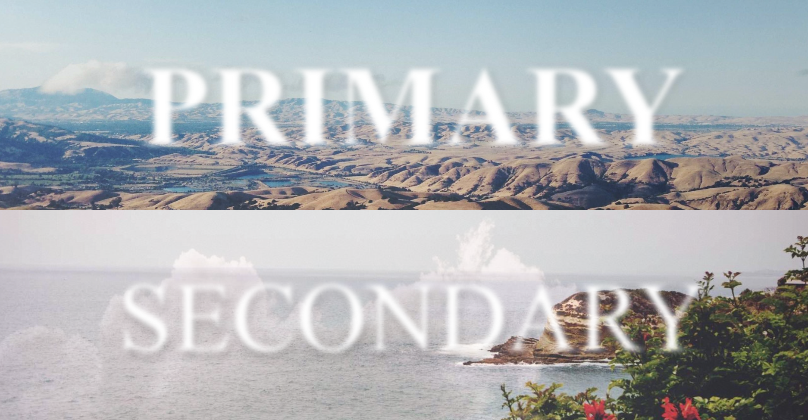

# Parallax effect in HTML CSS and JS
> Don't work in mobile (but it's responsive).

A page with two vertical parts, and two title in parts. This titles are blur but when you hover your mouse on it.
The background image and the titles follow your mouse with a parallax effect.